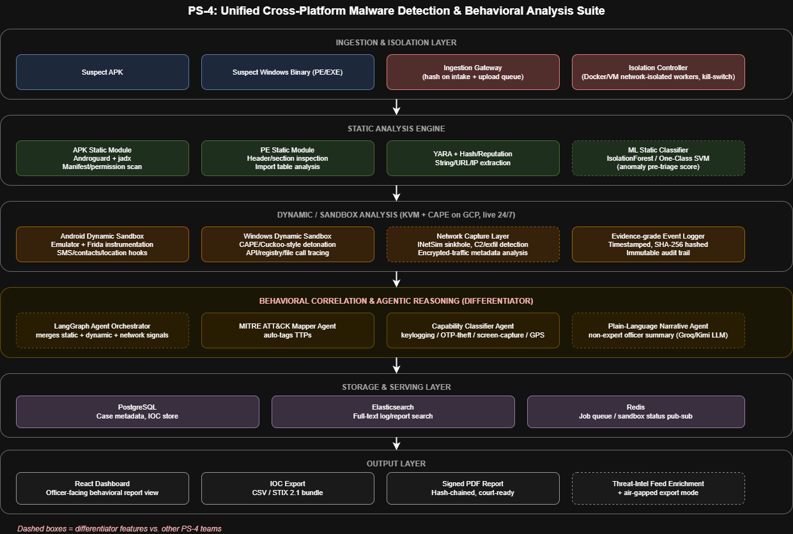

<div align="center">


# 🛡️ SentinelScan

### Unified Cross-Platform Malware Detection & Behavioral Analysis Suite

**Team HackersAPK** · E-Rakshak 2026 · Round 2 · **Rank 6 Qualifier**
Problem Statement `ERH26_PS_04` — Cybersecurity & Malware Analysis

[](#roadmap)
[](#)
[](./LICENSE)
[](#tech-stack)
[](#tech-stack)
[](#tech-stack)
[](#tech-stack)

*A localized, evidence-grade platform for police cyber-crime units to statically and dynamically analyze suspicious Android APKs and Windows executables — pinpointing what data is stolen, where it's sent, and delivering a plain-language report an investigator can act on.*

</div>

---

## 📑 Table of Contents

- [Problem Understanding](#-problem-understanding)
- [What Makes This Different](#-what-makes-this-different)
- [Architecture](#-architecture)
- [Tech Stack](#-tech-stack)
- [Repository Structure](#-repository-structure)
- [Getting Started](#-getting-started)
- [Team & Ownership](#-team--ownership)
- [Roadmap](#-roadmap)
- [Deployment](#-deployment)
- [Contributing Workflow](#-contributing-workflow)

---

## 🎯 Problem Understanding

Police departments routinely encounter endpoints compromised by spyware, RATs, and malicious APKs — light-bill fraud, loan-app scams, fake e-Challan/RTO schemes. Investigators need a **safe, isolated environment** to scan a suspect or victim device, determine exactly what capability the malware has (SMS theft, GPS tracking, screen capture) and where it exfiltrates to — across **both Windows and Android** — with a report that holds up as evidence and is readable by a non-technical officer.

**Core pipeline (per the PS):**

| Stage | What happens |
|---|---|
| 🔍 **Static Analysis** | Hashing, YARA/signature matching, APK manifest & permission scan, PE inspection, string/URL/IP extraction |
| 🧪 **Dynamic / Sandbox Analysis** | Isolated detonation, API/syscall + network traffic capture, file/registry/SMS access tracking |
| 🧠 **Behavioral Profiling** | Capability classification, MITRE ATT&CK mapping, plain-language summary |
| 📋 **Reporting & IOCs** | Exportable CSV/STIX, hash-chained evidence-grade logging |

**Bonus objectives targeted:** automated MITRE ATT&CK mapping · encrypted-traffic behavioral analysis (metadata-only, no decryption) · threat-intel enrichment · offline/air-gapped mode.

---

## ✨ What Makes This Different

Several teams are building against the same PS. Our locked differentiators:

| # | Feature | Why it matters |
|---|---|---|
| 1 | **India-specific scam detection rules** | YARA/behavioral signatures tuned to light-bill, loan-app, and e-Challan fraud patterns explicitly named in the PS — most teams build generic malware detection and miss this |
| 2 | **LangGraph agent correlation + plain-language narrative agent** | Turns raw static + dynamic + network signals into an investigator-readable summary instead of a raw log dump |
| 3 | **Hash-chained, signed chain-of-custody reporting** | Evidence-grade, court-ready reports — its own visible dashboard module, not a buried backend feature |

**Stretch goals (if time allows):** 24/7 live GCP-hosted sandbox · encrypted-traffic metadata analysis (JA3 fingerprinting) · Geo-IP mapping · AI-generated investigative recommendations · malware family tagging.

---

## 🏗️ Architecture

<div align="center">


<sub>Full editable diagram at <a href="./infra/PS4_Architecture.drawio"><code>infra/PS4_Architecture.drawio</code></a> (open in <a href="https://app.diagrams.net">diagrams.net</a>)</sub>
</div>

Six-layer pipeline, ingestion to investigator-ready output:

```
 ┌──────────────────────────────┐
 │  Ingestion & Isolation Layer │
 └───────────────┬───────────────┘
                  ▼
 ┌──────────────────────────────┐
 │   Static Analysis Engine      │  APK/PE modules · YARA · ML classifier
 └───────────────┬───────────────┘
                  ▼
 ┌──────────────────────────────┐
 │  Dynamic / Sandbox Analysis   │  KVM + CAPE on GCP · Android-x86 + Frida · INetSim
 └───────────────┬───────────────┘
                  ▼
 ┌──────────────────────────────┐
 │ Behavioral Correlation &      │  ★ differentiator layer
 │ Agentic Reasoning              │  LangGraph Orchestrator → MITRE Mapper →
 │                                │  Capability Classifier → Narrative Agent
 └───────────────┬───────────────┘
                  ▼
 ┌──────────────────────────────┐
 │  Storage & Serving             │  PostgreSQL · Elasticsearch · Redis
 └───────────────┬───────────────┘
                  ▼
 ┌──────────────────────────────┐
 │  Output                        │  React Dashboard · IOC Export · Signed PDF Report
 └──────────────────────────────┘
```

**Deployment model:** two-plane architecture — a public **Control Plane** (dashboard/API, port 443 only) and an isolated **Detonation Plane** (GCP `n2-standard-4`, nested virtualization, KVM/CAPE, network-contained via INetSim). See [Deployment](#-deployment).

---

## 🧰 Tech Stack

<table>
<tr><td width="50%" valign="top">

**Backend / Agents**

| Component | Choice |
|---|---|
| Agent orchestration | LangGraph |
| LLM routing | Groq (routine) + Kimi K2.6 via NVIDIA NIM (complex/narrative) |
| API | FastAPI |
| Auth | JWT (custom, hand-coded) |
| Databases | PostgreSQL, Elasticsearch, Redis |

</td><td width="50%" valign="top">

**Dynamic Sandbox**

| Component | Choice |
|---|---|
| Host | GCP Compute Engine `n2-standard-4`, nested virtualization |
| Hypervisor | KVM/QEMU |
| Sandbox engine | CAPE (Windows detonation, auto-revert golden snapshot) |
| Android sandbox | Android-x86 (QEMU) + Frida instrumentation |
| Network containment | INetSim sinkhole |

</td></tr>
</table>

**Frontend** — hand-coded, no AI page-builders, full control over report UX:

| Package | Version | | Package | Version |
|---|---|---|---|---|
| react / react-dom | 19.2.7 | | zustand | 5.0.14 |
| typescript | 7.0.2 | | @tanstack/react-query | 5.101.2 |
| vite | 8.1.4 | | gsap / @gsap/react | 3.15.0 |
| react-router-dom | 7.18.1 | | @xyflow/react | 12.11.2 |
| tailwindcss | 4.3.2 | | shadcn/ui (Radix) | latest |

**GSAP plugins in use:** ScrambleText (hero decrypt effect) · ScrollTrigger (scroll reveals) · DrawSVG (IOC graph line-draw) · SplitText (line-by-line report reveal) · useGSAP (React lifecycle hook).

---

## 📂 Repository Structure

```
ps4-malware-suite/
├── ingestion/                  # Ingestion gateway, isolation controller
├── static-analysis/            # APK/PE static modules, YARA, ML classifier      → Harsh
│   └── yara_rules/india_scam_rules/    # differentiator #1
├── dynamic-sandbox/            # CAPE config, Android-x86, network capture       → Sameer
├── agents/                     # differentiator #2                              → Neil
│   ├── orchestrator/           # LangGraph orchestrator (schema.py, orchestrator.py)
│   ├── mitre_mapper/
│   ├── capability_classifier/
│   └── narrative_agent/
├── storage/                    # DB schemas (postgres, elasticsearch)
├── backend/app/                 # FastAPI app                                   → Rajvardhan & Neil
├── frontend/src/                 # React dashboard, login, landing page          → Rajvardhan
├── docs/                       # weekly documentation (updated every week)      → Rajvardhan
└── infra/                      # GCP setup scripts, architecture diagram
```

---

## 🚀 Getting Started

**Infra — Postgres / Redis / Elasticsearch**

```bash
cp .env.example .env      # fill in GROQ_API_KEY, NVIDIA_NIM_API_KEY, GCP project details
docker-compose up -d      # Postgres + Redis + Elasticsearch
```

**Backend API — Docker** *(build context is the repo root)*

```bash
docker build -f backend/Dockerfile -t sentinelscan-backend .
docker run --env-file .env -p 8000:8000 sentinelscan-backend
```

**Backend API — local (without Docker)**

```bash
pip install -r backend/requirements.txt
uvicorn backend.app.main:app --host 0.0.0.0 --port 8000 --reload
```

API docs available at `http://localhost:8000/docs` once running.

**Agent orchestrator** (standalone test)

```bash
pip install -r agents/orchestrator/requirements.txt
python agents/orchestrator/orchestrator.py
```

Runs the LangGraph pipeline against mock static-analysis data — confirms the graph end-to-end without needing the live sandbox.

**Frontend**

```bash
cd frontend
npm install
npm run dev
```

---

## 👥 Team & Ownership

| Member | Owns |
|---|---|
| **Rajvardhan Singh Chauhan** | Frontend, backend & docs — React dashboard, FastAPI app layer, weekly documentation |
| **Neil Banerjee** | AI/ML & backend — LangGraph orchestrator, MITRE mapper, capability classifier, narrative agent, FastAPI app layer |
| **Sameer Bhavsar** | Dynamic analysis — GCP sandbox infra, KVM/CAPE, Android-x86, INetSim, evidence logger |
| **Harsh Vyas** | Static analysis — APK/PE static engine, YARA rules (incl. India scam rules), string/IOC extraction |

Weekly sync: every Thursday mentor meeting, each member demos their slice against the same sample.

---

## 🗺️ Roadmap

| Week | Dates | Focus |
|---|---|---|
| 1 | Wed 08 – Thu 09 Jul | Scope lock, architecture, repo, GCP provisioning, sample sourcing |
| 2 | Fri 10 – Thu 16 Jul | Static analysis engine, ingestion/isolation, GCP+CAPE install, orchestrator skeleton |
| 3 | Fri 17 – Thu 23 Jul | Dynamic sandbox live (Android + Windows), network capture, orchestrator wired to real data |
| 4 | Fri 24 – Thu 30 Jul | MITRE/capability/narrative agents finalized, dashboard (Process Tree, Risk Score, Evidence Timeline), PPT + demo video, final submission on Unstop |

Full plan with daily/task-level detail: see `docs/` and the project plan PDF.

---

## 🌐 Deployment

**Control Plane** *(public)* — Dashboard, API, DB, reverse-proxied via Nginx + Let's Encrypt, port 443 only.

**Detonation Plane** *(isolated)* — GCP `n2-standard-4`, Ubuntu 22.04, nested virtualization enabled at creation. KVM/QEMU + CAPE for Windows detonation with auto-reverting golden snapshot; Android-x86 QEMU VM with Frida. All victim-VM traffic is routed through INetSim — no real internet access, so captured C2/exfil behavior is observed safely. SSH-only management access; only the Control Plane is internet-facing.

> 💰 **Cost:** $0 for the full hackathon timeline — a new GCP account's $300/90-day trial credit covers it.

---

## 🔧 Contributing Workflow

```bash
git checkout -b feature/<short-description>
# ...make changes...
git add .
git commit -m "clear, specific message"
git push -u origin feature/<short-description>
# open a PR into main
```

- ❌ Never commit real malware samples — `dynamic-sandbox/samples/` and `*.apk`/`*.exe` are gitignored
- ❌ Never commit `.env` — use `.env.example` as the template
- ✅ Keep `docs/weekX.md` updated every week, not just at submission time

---

<div align="center">

**Submission:** Final prototype, documentation, PPT, and demo video submitted via Unstop at end of Week 4.

Made with 🛡️ by **Team HackersAPK**

</div>
